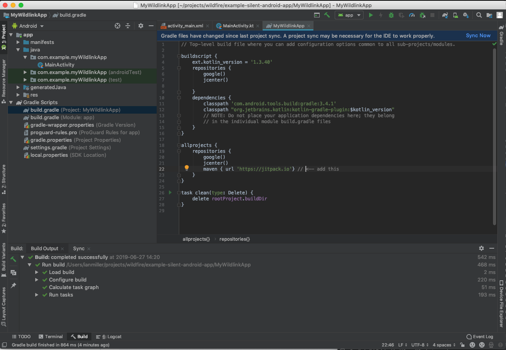
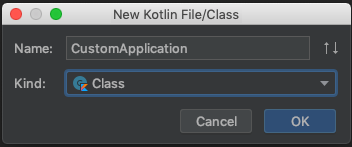
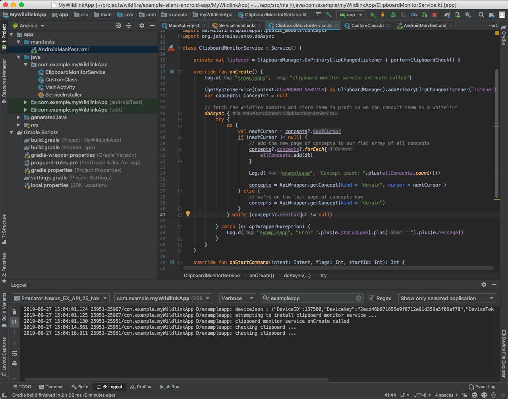
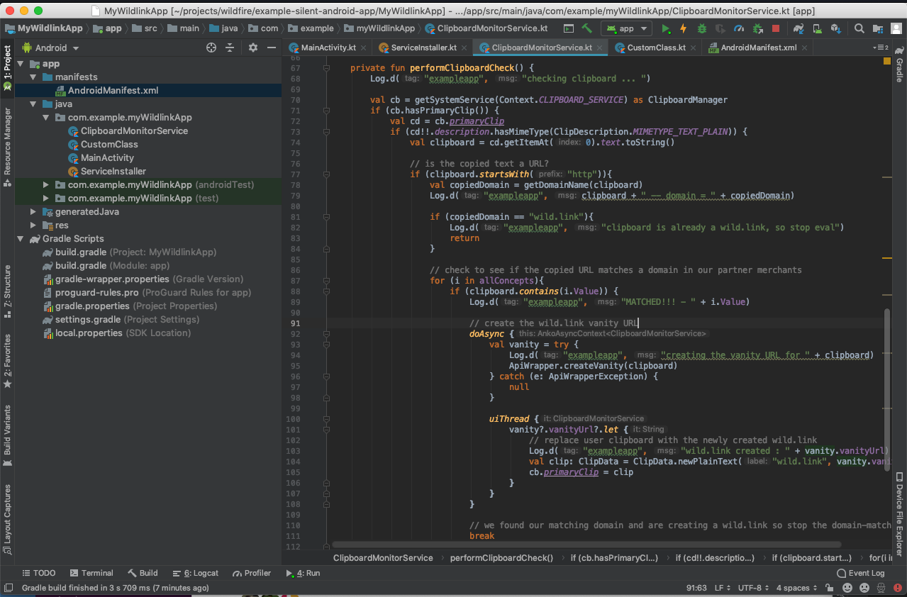

### Overview

Wildlink offers several products which make it easy to monetize references to brands and products. In this walk-through we'll be describing how to monetize an Android user's clipboard in your host application. By the end of this example, your application will be automatically converting any eligible copied link into a "wild.link." When anyone clicks through a wild.link and makes an eligible purchase, your host app will earn a commission (varies from a flat amount to 1-10% of the sale). You can then choose to split this revenue with your app user as you see fit (i.e. converting to your own points system).

In this example you will learn how to:

-   Import the Wildlink SDK for Android
-   Create a device
-   Download merchant domains from the Wildlink service
-   Monitoring the clipboard for changes
-   Matching the user's clipboard to the merchant domain list

Notes before proceeding

-   The Wildlink API Wrapper requires a minimum Android SDK version of 15.
-   This example references Android Studio 3.4.1 and uses Kotlin.
-   The Wildlink SDK uses no third party libraries, but this example uses Anko for simplicity.
-   This example assumes you're running an Android N (API level 25) or older emulator (see notes at the end of this example for considerations related to Android O and newer).


### Create a New Project and Import the Wildlink's API Wrapper for Android

First, create a new project and select "Empty Activity"


Next, name your project, select Kotlin language and select "Use androidx.* artifacts. Select Finish.


After a few moments, your project will be created. The next step is to import the necessary libraries, including the Wildlink SDK. Under Project, open Gradle Scripts and select build.gradle (Project:...). Add the following maven jitpack line as shown below.

```
maven { url 'https://jitpack.io'}
```



Next, open the build.gradle (Module: app) file and add to your dependencies the Wildlink SDK as well as the Anko library. Anko is not a required library, but it aids in keeping our example simple.

```
implementation "com.github.wildlink:apiwrapper:1.0.0.26"
implementation 'org.jetbrains.anko:anko-common:0.10.8'
```


Select "Sync Now" from the top right of your window to sync your project (which loads the dependencies).

### Create a device with Wildlink

Before we can invoke any of Wildlink's API calls, we must first register our client. We call this registration "creating a device" because all other actions use this device reference to represent the client.

You will create a custom application class to initialize the Wildlink SDK and then in your MainActivity you'll call the ApiWrapper's createDevice method.

Select File -> New -> Kotlin File/Class, name your class (we'll use CustomApplication for this example) and select Class as the Kind.



Insert the following code into this new file:

```kotlin
package com.example.myWildlinkApp

import android.app.Application
import me.wildfire.apiwrapper.ApiWrapper

class CustomApplication : Application(){
  override fun onCreate() {
    super.onCreate()

    ApiWrapper.setAppId("INSERT WILDLINK APP ID")
    .setConnectTimeout(15000)
    .setReadTimeout(15000)
    .setLogLevel(1)
    .setSecret("INSERT WILDLINK APP SECRET")
  }
}
```

Replace the APP ID and APP SECRET strings with your actual values (contact [support@wildlink.me](mailto:support@wildlink.me) if you need credentials created or if you forgot them).

Next, you'll add this CustomApplication to your AndroidManifest.xml. Inside the "application" tag, add the following property:

```xml
android:name=".CustomApplication"
```


Now, back in your MainActivity.kt, in your onCreate function, you'll add the following code:

```kotlin
doAsync {
  // you only have to do this one time in one activity
  val preferences = getSharedPreferences("myprefs", Context.MODE_PRIVATE)
  // find if you have previously stored the device
  var deviceJson = preferences.getString("device",null)

  if( deviceJson == null) {
    // does not exist save it and set it in the apiwrapper
    deviceJson = try {
      ApiWrapper.createDevice()
      } catch (e: ApiWrapperException) {
        uiThread {
          alert("Error creating device ".plus(e.statusCode).plus(" ").plus(e.message)) {
            }.show()
          }
          null
        }

        deviceJson?.let {
          val editor = preferences.edit()
          editor.putString("device", deviceJson)
          editor.commit()
          Log.d("exampleapp","deviceJson : " + deviceJson)

          // we'll get back to this service in a moment
          //ServiceInstaller.installServices(this@MainActivity)
        }
        } else {
          ApiWrapper.setDevice(Device(deviceJson))
        }
      }
```

This code is calling the ApiWrapper.createDevice() method on a background process (via doAsync) and storing the resulting data (the new device information) in the SharedPreferences. Subsequent launches will use this stored data to re-establish the device via the ApiWrapper.setDevice() method.

Running the app at this point will display the device information (deviceJson) in logcat. We have now successfully created a device and can make further requests of the Wildlink API!

### Monitoring the Clipboard for Matches

Now let's create the meat of our application. We'll add a service that will download the merchant domains (i.e. walmart.com), monitor the user's clipboard for changes and match any copied text to our list of merchant domains. When a match is found, we'll generate a wild.link and replace the user's clipboard with this wild.link.

First, let's set up the background process.

We need to create two new Kotlin files to support our background process:

-   ClipboardMonitorService.kt
-   ServiceInstaller.kt

In ServiceInstaller.kt place the following content:

```kotlin
package com.example.api_wrapper_example_jun_27_2019

import android.content.Context
import android.content.Intent

import android.util.Log

object ServiceInstaller {
  fun installServices(context: Context) {
    // start the clipboard watching service
    Log.d("exampleapp", "attempting to install clipboard monitor service ... ")

    val clipboardIntent = Intent(context, ClipboardMonitorService::class.java)
    context.startService(clipboardIntent)
  }
}
```
In ClipboardMonitorService.kt put the following code for now:

```kotlin
package com.example.myWildlinkApp

import android.app.Service
import android.content.*
import android.os.IBinder
import android.util.Log
import me.wildfire.apiwrapper.public_models.Concept
import me.wildfire.apiwrapper.public_models.Concepts
import java.net.URI
import java.net.URISyntaxException

class ClipboardMonitorService : Service() {

  private val listener = ClipboardManager.OnPrimaryClipChangedListener { performClipboardCheck() }

  override fun onCreate() {
    Log.d("exampleapp", "clipboard monitor service onCreate called")
    (getSystemService(Context.CLIPBOARD_SERVICE) as ClipboardManager).addPrimaryClipChangedListener(listener)
    var concepts: Concepts? = null
  }

  override fun onStartCommand(intent: Intent, flags: Int, startId: Int): Int {
    return Service.START_REDELIVER_INTENT
  }

  override fun onBind(intent: Intent): IBinder? {
    return null
  }

  @Throws(URISyntaxException::class)
  fun getDomainName(url: String): String {
    val uri = URI(url)
    val domain = uri.getHost()
    return if (domain.startsWith("www.")) domain.substring(4) else domain
  }

  private fun performClipboardCheck() {
    Log.d("exampleapp", "checking clipboard ... ")
  }

  companion object {
    val allConcepts:MutableList<Concept> = mutableListOf()
  }
}
```


Now, in your MainActivity.kt, uncomment the following line:

```kotlin
  ServiceInstaller.installServices(this@MainActivity)
```


And, finally, in your AndroidManifest.xml, add the following tag in your application:

```xml
<service android:name=".ClipboardMonitorService"/>
```


Uninstall your app if you have previously installed it, and run it. You'll notice in logcat that we send a debug line every time you copy new text. We're not doing anything with that clipboard content yet, but we're able to see that we get called every time the clipboard changes.

  --------------------------------------------------------------------------------------------------------------------------------------------------------------------------------------------------------------------------------------------------------------------------------------------------------------------------------------------------------------------------------------------------------------------------------------------------------------
  **Important note**: Android will sometimes kill off services based on available system resources. Starting a proper foreground service is outside the scope of this example but there is ample documentation for how to employ a foreground service. If you're not seeing the messages in logcat when you copy new text, your service may have been terminated. See the notes at the end of this document for more information on this subject.
  --------------------------------------------------------------------------------------------------------------------------------------------------------------------------------------------------------------------------------------------------------------------------------------------------------------------------------------------------------------------------------------------------------------------------------------------------------------

Now, let's fetch the list of merchant domains via the ApiWrapper and populate a List so that we'll have something to compare the copied text to. Modify the onCreate method for your ClipboardMonitorService so that it looks like the following:

```kotlin
override fun onCreate() {
  Log.d("exampleapp", "clipboard monitor service onCreate called")

  (getSystemService(Context.CLIPBOARD_SERVICE) as ClipboardManager).addPrimaryClipChangedListener(listener)
  var concepts: Concepts? = null

  // fetch the Wildfire domains and store them in prefs so we can consult them as a whitelist
  doAsync {
    try {
      do {
        val nextCursor = concepts?.nextCursor
        if (nextCursor != null) {
          // add the new page of concepts to our flat array of all concepts
          concepts?.concepts?.forEach{
            allConcepts.add(it)
          }

          Log.d("exampleapp", "Concept count: ".plus(allConcepts.count()))

          concepts = ApiWrapper.getConcept(kind = "domain", cursor = nextCursor )
          } else {
            // we're on the last page of concepts now
            concepts = ApiWrapper.getConcept(kind = "domain")
          }
          } while (concepts?.nextCursor != null)

          } catch (e: ApiWrapperException) {
            Log.d("exampleapp", "Error ".plus(e.statusCode).plus(" ").plus(e.message))
          }
        }
      }
```



Running the application again, you'll be able to see in logcat the Concept (domain) count grow as we request each page of results and add it to our allConcepts companion object.

Next, let's evaluate the user's clipboard and determine if we have a URL that we can convert to a wild.link. Change your performClipboardCheck method to look like the following:

```kotlin
private fun performClipboardCheck() {
  Log.d("exampleapp", "checking clipboard ... ")

  val cb = getSystemService(Context.CLIPBOARD_SERVICE) as ClipboardManager
  if (cb.hasPrimaryClip()) {
    val cd = cb.primaryClip
    if (cd!!.description.hasMimeType(ClipDescription.MIMETYPE_TEXT_PLAIN)) {
      val clipboard = cd.getItemAt(0).text.toString()

      // is the copied text a URL?
      if (clipboard.startsWith("http")){
        val copiedDomain = getDomainName(clipboard)
        Log.d("exampleapp", clipboard + " -- domain = " + copiedDomain)

        if (copiedDomain == "wild.link"){
          Log.d("exampleapp", "clipboard is already a wild.link, so stop eval")
          return
        }

        // check to see if the copied URL matches a domain in our partner merchants
        for (i in allConcepts){
          if (clipboard.contains(i.Value)) {
            Log.d("exampleapp", "MATCHED!!! - " + i.Value)

            // we found our matching domain and are creating a wild.link so stop the domain-matching loop
            break
          }
        }
        } else {
          Log.d("exampleapp", "copied text is not a URL")
        }
      }
    }
  }
```

Run your application again and try copying a URL for a website like walmart.com (Wildlink's partner list is always changing, but Walmart is usually a pretty safe bet for testing). Note that in logcat you'll get a "MATCHED!!!" message. Try copying something else (i.e. [http://foo.com/](http://foo.com/) or some plain text that isn't a URL) and you'll notice it doesn't match when it's not a URL in the Wildlink network.

  ------------------------------------------------------------------------------------------------------------------------------------------------------------------------------------------------------------------------------------------
  **Note**: This matching technique is very simplified (using the contains method) and should not be used for production code. A proper matching technique would ensure that the copied domain ends with the merchant domain.
  ------------------------------------------------------------------------------------------------------------------------------------------------------------------------------------------------------------------------------------------

There's just one last step: creating the wild.link based on the user's copied URL. Add the following code just around line 90:

```kotlin
// create the wild.link vanity URL
doAsync {
  val vanity = try {
    Log.d("exampleapp", "creating the vanity URL for " + clipboard)
    ApiWrapper.createVanity(clipboard)
    } catch (e: ApiWrapperException) {
      null
    }

    uiThread {
      vanity?.vanityUrl?.let {
        // replace user clipboard with the newly created wild.link
        Log.d("exampleapp", "wild.link created : " + vanity.vanityUrl)
        val clip: ClipData = ClipData.newPlainText("wild.link", vanity.vanityUrl)
        cb.primaryClip = clip
      }
    }
  }
```



This last piece of code makes an async call to the ApiWrapper's createVanity method and returns a data structure with a vanityUrl in it (we refer to these short URLs as "vanity" URLs). It then writes this returned vanityUrl value to the user's clipboard.

### Final Code

You can find the final code for our example in the public Github repository here: [https://github.com/wildlink/android-clipboard-example](https://github.com/wildlink/android-clipboard-example)

### UX Considerations

In our development of our [demo Android app](https://play.google.com/store/apps/details?id=me.wildlink.shareapp&hl=en_US), we found that users wanted to know when their copied URL was converted. We suggest showing the user a local notification (using peek and vibration) as positive feedback that their clipboard contents have changed. This feedback reminds the user of your valuable service which is enabling them to earn and can be a delightful moment where the user is pleasantly surprised to find they can earn on the link they just copied.

We also found that sometimes users wanted an Undo option to restore their clipboard contents (usually depending on what the copied URL was and who they were sending it to).

You can find examples of both of these behaviors in our [demo Android app](https://play.google.com/store/apps/details?id=me.wildlink.shareapp&hl=en_US).

### Background Processes

Note that the process started in this example will be terminated with the host application if the application is "swiped away" by the user (i.e. force closed). On Android versions N (API level 25) and older, you may detect when the host application is terminated (either by the user or by the OS due to resource constraints) and immediately restart it. There are similar strategies for starting the service on boot-up of the Android device.

With Android O, as part of Google's effort to bring more user transparency to long-running processes, Android's policy requires that the host application run a foreground service with accompanying persistent notification.

More information on best practices related to foreground services can be found on the Android Developers Blog: [https://android-developers.googleblog.com/2018/12/effective-foreground-services-on-android_11.html](https://android-developers.googleblog.com/2018/12/effective-foreground-services-on-android_11.html)